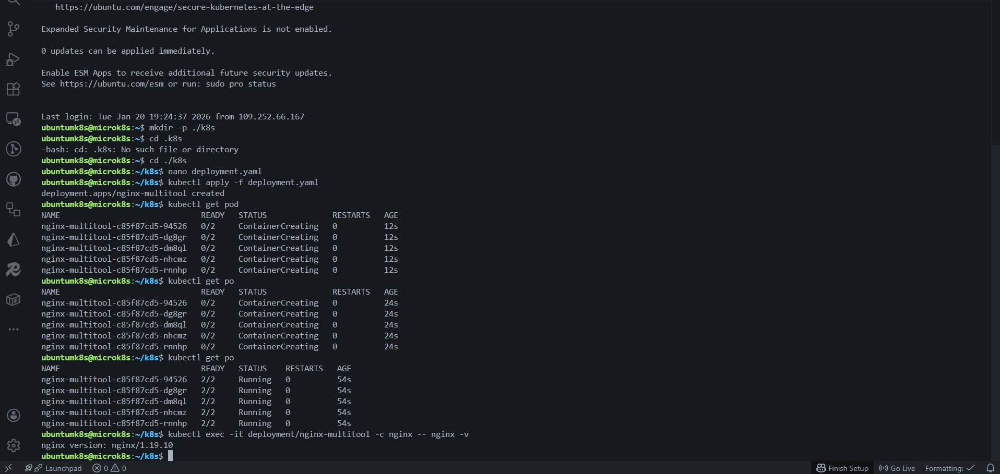
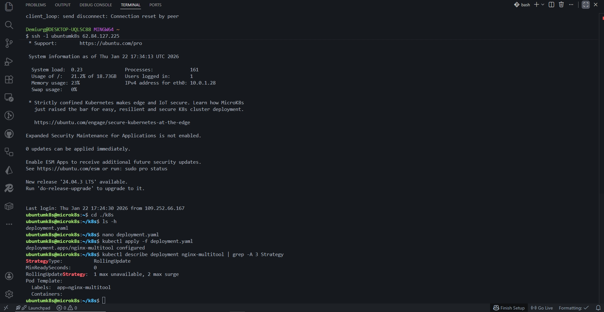
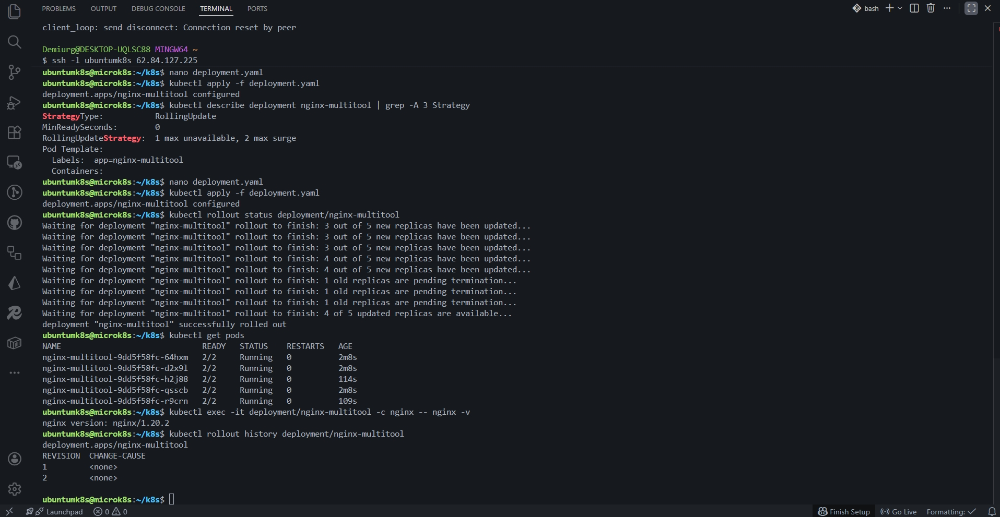
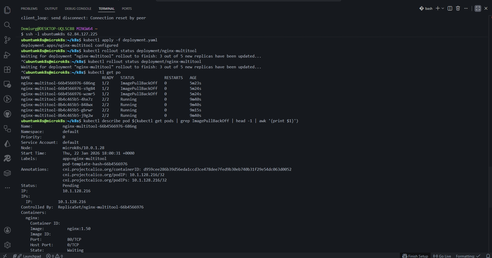
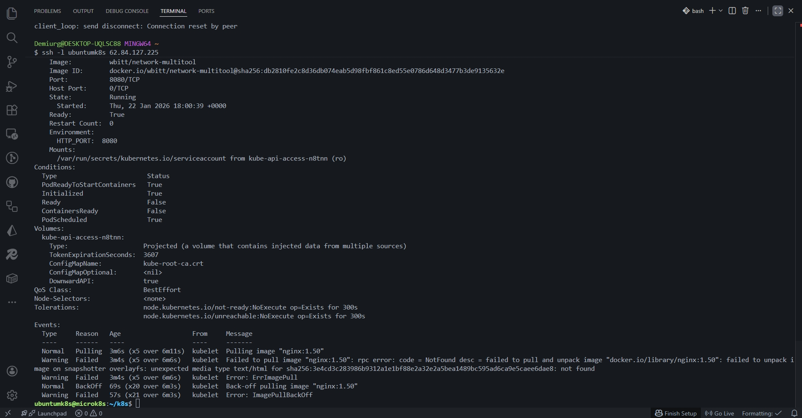
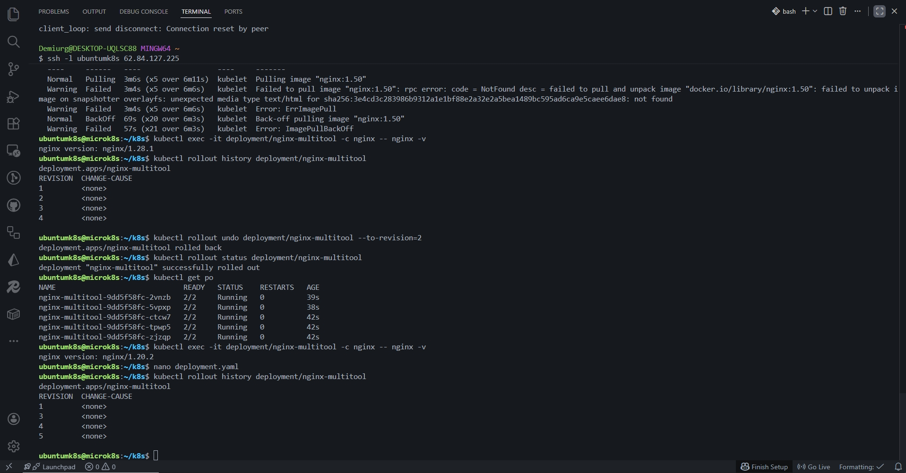

# «Обновление приложений»

## Задание 1. Выбрать стратегию обновления приложения и описать ваш выбор

### Выбранная стратегия: `Recreate`

### Обоснование выбора:

1. **Несовместимость версий (мажорное обновление)**
   - Новая версия приложения несовместима со старой версией
   - При использовании `RollingUpdate` старая и новая версии работали бы одновременно, что привело бы к ошибкам и непредсказуемому поведению
   - `Recreate` гарантирует, что в любой момент времени работает только одна версия приложения

2. **Ограниченные ресурсы кластера**
   - Ресурсы кластера ограничены (запас составляет только 20%)
   - `Recreate` не требует дополнительных ресурсов, так как сначала удаляет все старые поды, а только потом создает новые
   - `RollingUpdate` требовал бы запуска новых подов до удаления старых, что превысило бы доступные ресурсы

3. **Безопасность обновления**
   - `Recreate` исключает риск одновременной работы несовместимых версий
   - Гарантирует целостность данных и предсказуемое поведение приложения

### Недостатки выбранной стратегии:

- Кратковременный downtime (простой) во время обновления
- Данный недостаток приемлем, учитывая критическое требование несовместимости версий и ограниченность ресурсов

---

## Задание 2. Обновление приложения

---

- [Ссылка на deployment-multi-container manifest](./k8s/deployment-multi-container.yaml)
