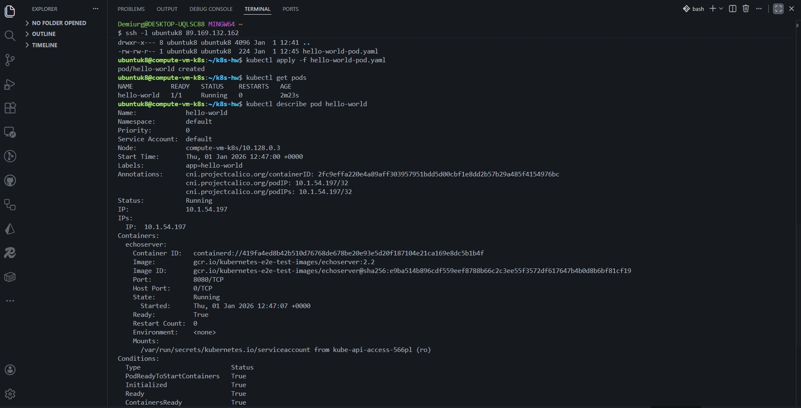
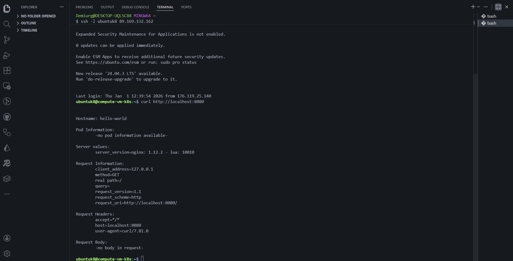
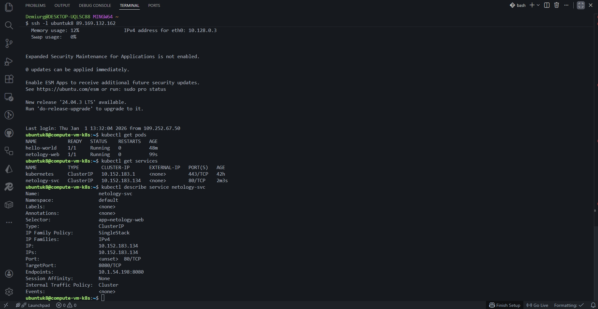
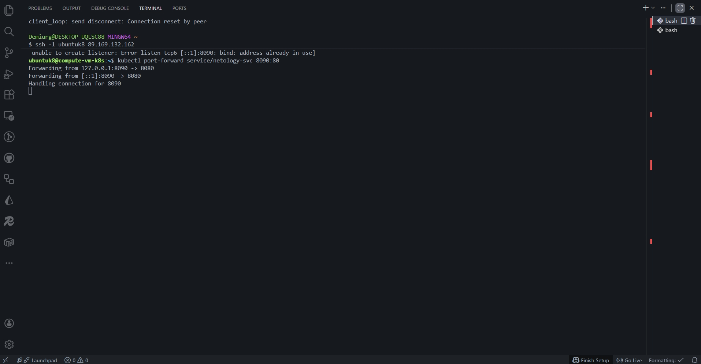
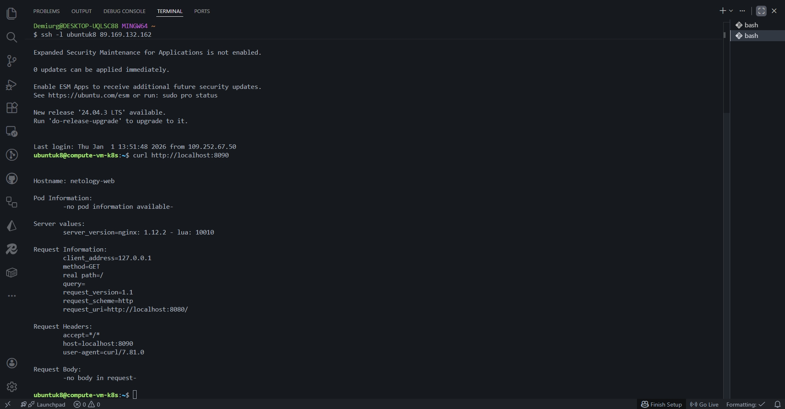

## Задание 1:

---

## Задание 2:

---

[Ссылка на hellow-world pod manifest](./k8s/hello-world-pod.yaml)
[Ссылка на netology-web pod manifest](./k8s/netology-web-pod.yaml)
[Ссылка на netology-svc-service manifest](./k8s/netology-svc-service.yaml)
