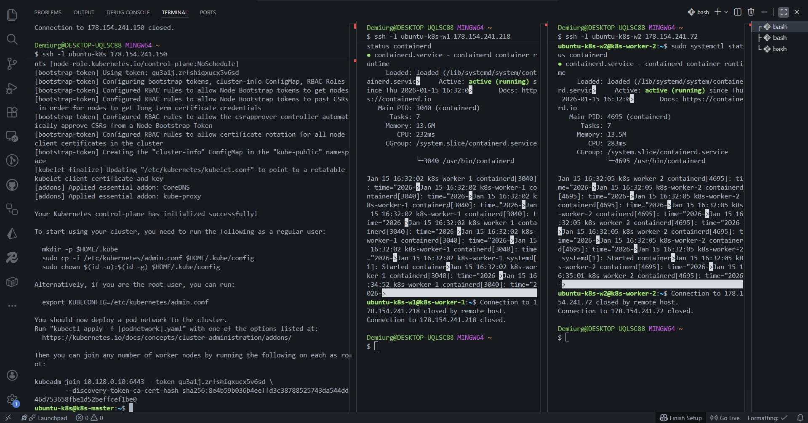
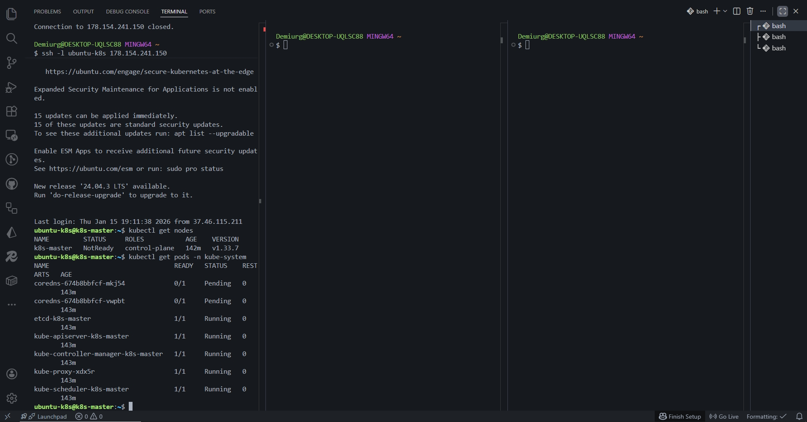
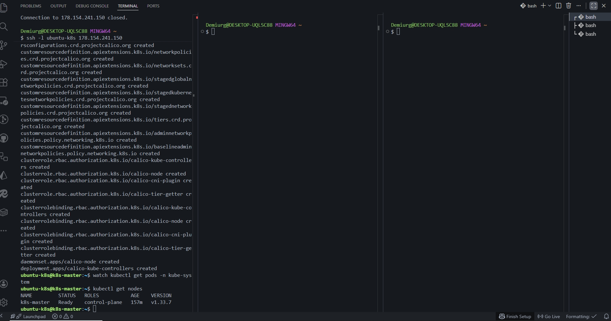
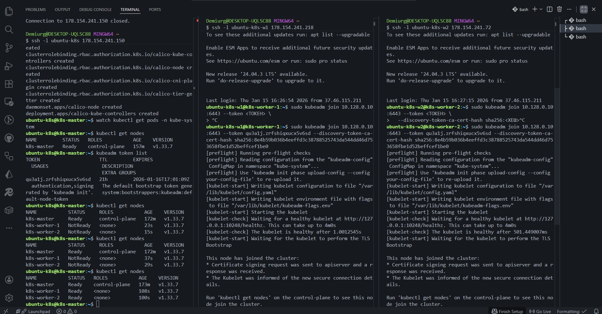
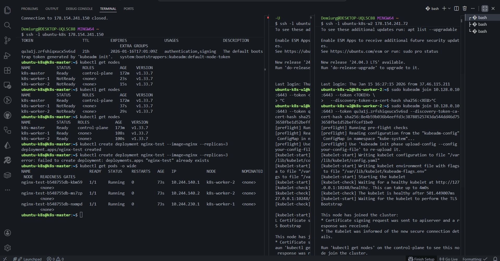
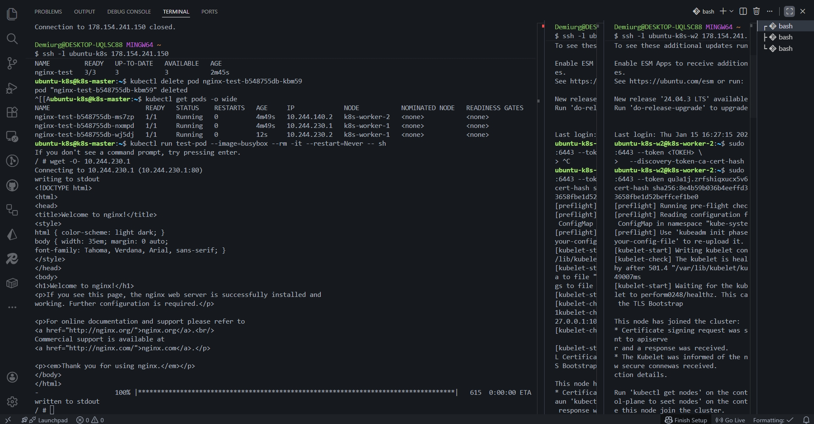

## Задание 1:













# Домашнее задание: Установка Kubernetes

## Описание задания

Установка кластера Kubernetes с 1 master-нодой и 2 worker-нодами с использованием kubeadm.

## Параметры кластера

- **Инструмент установки:** kubeadm
- **Версия Kubernetes:** v1.33.7
- **Container Runtime:** containerd
- **CNI Plugin:** Calico v3.31.3
- **Операционная система:** Ubuntu 22.04 LTS

## Архитектура кластера

### Ноды

| Нода         | Роль          | Внутренний IP | Публичный IP    | vCPU | RAM  |
| ------------ | ------------- | ------------- | --------------- | ---- | ---- |
| k8s-master   | Control Plane | 10.128.0.10   | 178.154.241.150 | 2    | 4 GB |
| k8s-worker-1 | Worker        | 10.128.0.5    | 178.154.241.218 | 2    | 2 GB |
| k8s-worker-2 | Worker        | 10.128.0.15   | 178.154.241.72  | 2    | 2 GB |

### Компоненты Control Plane

- **kube-apiserver** — REST API для управления кластером (порт 6443)
- **etcd** — распределённая база данных состояния кластера
- **kube-scheduler** — планировщик подов на ноды
- **kube-controller-manager** — контроллеры состояния кластера

## Процесс установки

### 1. Подготовка инфраструктуры

Создание виртуальных машин в Yandex Cloud:

- Ubuntu 22.04 LTS
- Настройка SSH-доступа
- Открытие необходимых портов

### 2. Подготовка всех нод

Выполнено на всех трёх нодах:

```bash
# Отключение swap
sudo swapoff -a
sudo sed -i '/ swap / s/^/#/' /etc/fstab

# Загрузка модулей ядра
sudo modprobe overlay
sudo modprobe br_netfilter

# Настройка постоянной загрузки модулей
cat <<EOF | sudo tee /etc/modules-load.d/k8s.conf
overlay
br_netfilter
EOF

# Настройка сетевых параметров ядра
cat <<EOF | sudo tee /etc/sysctl.d/k8s.conf
net.bridge.bridge-nf-call-iptables  = 1
net.bridge.bridge-nf-call-ip6tables = 1
net.ipv4.ip_forward                 = 1
EOF

sudo sysctl --system
```

### 3. Установка containerd

```bash
# Установка containerd
sudo apt-get update
sudo apt-get install -y containerd

# Генерация конфигурации
sudo mkdir -p /etc/containerd
sudo containerd config default | sudo tee /etc/containerd/config.toml

# Настройка SystemdCgroup (критически важно!)
sudo sed -i 's/SystemdCgroup = false/SystemdCgroup = true/' /etc/containerd/config.toml

# Перезапуск и автозагрузка
sudo systemctl restart containerd
sudo systemctl enable containerd
```

### 4. Установка kubeadm, kubelet, kubectl

```bash
# Подготовка репозитория
sudo mkdir -p -m 755 /etc/apt/keyrings
curl -fsSL https://pkgs.k8s.io/core:/stable:/v1.33/deb/Release.key | \
  sudo gpg --dearmor -o /etc/apt/keyrings/kubernetes-apt-keyring.gpg

echo 'deb [signed-by=/etc/apt/keyrings/kubernetes-apt-keyring.gpg] https://pkgs.k8s.io/core:/stable:/v1.33/deb/ /' | \
  sudo tee /etc/apt/sources.list.d/kubernetes.list

# Установка компонентов
sudo apt-get update
sudo apt-get install -y kubelet kubeadm kubectl

# Фиксация версий
sudo apt-mark hold kubelet kubeadm kubectl

# Автозапуск kubelet
sudo systemctl enable --now kubelet
```

### 5. Инициализация master-ноды

Выполнено на k8s-master:

```bash
sudo kubeadm init \
  --apiserver-advertise-address=10.128.0.10 \
  --pod-network-cidr=10.244.0.0/16 \
  --apiserver-cert-extra-sans=178.154.241.150
```

**Параметры:**

- `--apiserver-advertise-address` — внутренний IP для взаимодействия с worker-нодами
- `--pod-network-cidr` — диапазон IP для подов (требуется для Calico)
- `--apiserver-cert-extra-sans` — публичный IP для удалённого доступа через kubectl

### 6. Настройка kubectl на master

```bash
mkdir -p $HOME/.kube
sudo cp -i /etc/kubernetes/admin.conf $HOME/.kube/config
sudo chown $(id -u):$(id -g) $HOME/.kube/config
```

### 7. Установка CNI-плагина Calico

```bash
kubectl apply -f https://raw.githubusercontent.com/projectcalico/calico/v3.31.3/manifests/calico.yaml
```

**Calico обеспечивает:**

- Сетевое взаимодействие между подами
- Поддержку NetworkPolicy
- Маршрутизацию трафика между нодами

### 8. Подключение worker-нод

Выполнено на k8s-worker-1 и k8s-worker-2:

```bash
sudo kubeadm join 10.128.0.10:6443 --token <TOKEN> \
  --discovery-token-ca-cert-hash sha256:<HASH>
```

Токен получен после выполнения `kubeadm init` на master-ноде.

## Результаты установки

### Статус нод

```bash
kubectl get nodes -o wide
```

**Вывод:**

```
NAME           STATUS   ROLES           AGE   VERSION   INTERNAL-IP    EXTERNAL-IP   OS-IMAGE             KERNEL-VERSION     CONTAINER-RUNTIME
k8s-master     Ready    control-plane   3h    v1.33.7   10.128.0.10    <none>        Ubuntu 22.04 LTS     5.15.0-164-generic containerd://1.7.x
k8s-worker-1   Ready    <none>          2h    v1.33.7   10.128.0.5     <none>        Ubuntu 22.04 LTS     5.15.0-164-generic containerd://1.7.x
k8s-worker-2   Ready    <none>          2h    v1.33.7   10.128.0.15    <none>        Ubuntu 22.04 LTS     5.15.0-164-generic containerd://1.7.x
```

---

### Системные поды

```bash
kubectl get pods -n kube-system -o wide
```

**Вывод показывает:**

- ✅ Control plane компоненты (apiserver, scheduler, controller-manager, etcd) — Running на master
- ✅ CoreDNS — Running, обеспечивает DNS внутри кластера
- ✅ kube-proxy — Running на всех нодах, управляет сетевыми правилами
- ✅ calico-node — Running на всех нодах, обеспечивает сетевую связность
- ✅ calico-kube-controllers — Running, управляет конфигурацией Calico

---

### Версии компонентов

```bash
kubectl version
```

**Client Version:** v1.33.7  
**Server Version:** v1.33.7

---

## Проверка работоспособности

### Тест 1: Развёртывание приложения

```bash
kubectl create deployment nginx-test --image=nginx --replicas=3
kubectl get pods -o wide
```

**Результат:**

- 3 пода nginx распределены по worker-нодам
- Все поды в статусе Running
- Каждый под получил IP из диапазона 10.244.0.0/16

---

### Тест 2: Самовосстановление

```bash
kubectl delete pod <pod-name>
kubectl get pods --watch
```

**Результат:**

- После удаления пода ReplicaSet автоматически создал новый
- Желаемое состояние (3 реплики) восстановлено за ~20 секунд

---

### Тест 3: Сетевое взаимодействие

```bash
kubectl run test-pod --image=busybox --rm -it --restart=Never -- sh
# Внутри пода:
wget -O- <IP-любого-nginx-пода>
nslookup kubernetes.default
```

**Результат:**

- ✅ Под может достучаться до других подов по IP (Calico работает)
- ✅ DNS разрешение работает (CoreDNS работает)

---

## Использованные манифесты

### Calico CNI

Официальный манифест Calico v3.31.3:

```
https://raw.githubusercontent.com/projectcalico/calico/v3.31.3/manifests/calico.yaml
```

### Тестовое приложение

Создано через kubectl (императивная команда):

```bash
kubectl create deployment nginx-test --image=nginx --replicas=3
```

Эквивалентный YAML-манифест:

```yaml
apiVersion: apps/v1
kind: Deployment
metadata:
  name: nginx-test
  labels:
    app: nginx-test
spec:
  replicas: 3
  selector:
    matchLabels:
      app: nginx-test
  template:
    metadata:
      labels:
        app: nginx-test
    spec:
      containers:
        - name: nginx
          image: nginx
          ports:
            - containerPort: 80
```

---

## Полезные команды

### Управление кластером

```bash
# Просмотр нод
kubectl get nodes

# Просмотр всех подов во всех namespace
kubectl get pods -A

# Подробная информация о ноде
kubectl describe node <node-name>

# Логи пода
kubectl logs <pod-name>

# Выполнение команды в контейнере
kubectl exec -it <pod-name> -- bash
```

### Диагностика

```bash
# Проверка статуса компонентов control plane
kubectl get componentstatuses

# События в кластере
kubectl get events --sort-by='.lastTimestamp'

# Информация о ресурсах
kubectl top nodes  # (требует metrics-server)
```

---

## Возможные проблемы и решения

### Проблема: Нода в статусе NotReady

**Причина:** CNI-плагин не установлен или не работает

**Решение:**

```bash
kubectl get pods -n kube-system | grep calico
# Проверить, что calico-node Running на всех нодах
```

---

### Проблема: Поды CoreDNS в статусе Pending

**Причина:** CNI-плагин не установлен

**Решение:** Установить Calico (см. шаг 7)

---

### Проблема: kubelet не запускается

**Причина:** swap не отключен или неправильная настройка cgroups

**Решение:**

```bash
# Проверить swap
free -h

# Проверить cgroups в containerd
sudo grep SystemdCgroup /etc/containerd/config.toml
# Должно быть: SystemdCgroup = true
```

---

### Проблема: Токен для join истёк

**Решение:**

```bash
# На master-ноде создать новый токен
kubeadm token create --print-join-command
```

---

## Выводы

✅ Успешно развёрнут production-ready кластер Kubernetes  
✅ Использован официальный инструмент kubeadm  
✅ Настроена отказоустойчивая сеть с помощью Calico  
✅ Протестирована работоспособность через развёртывание приложения  
✅ Кластер готов к развёртыванию реальных приложений
