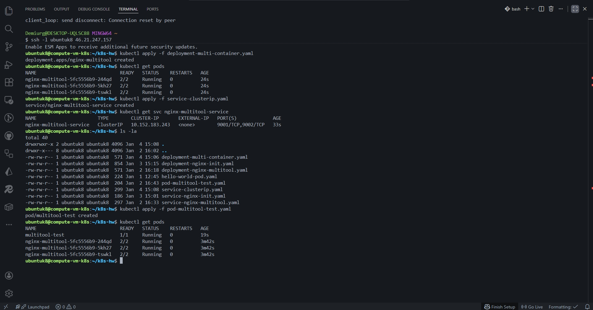
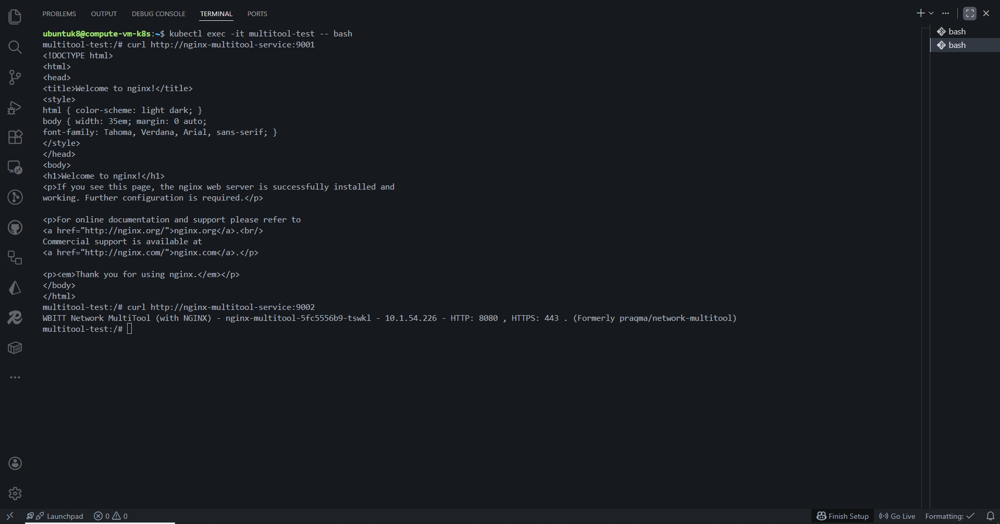
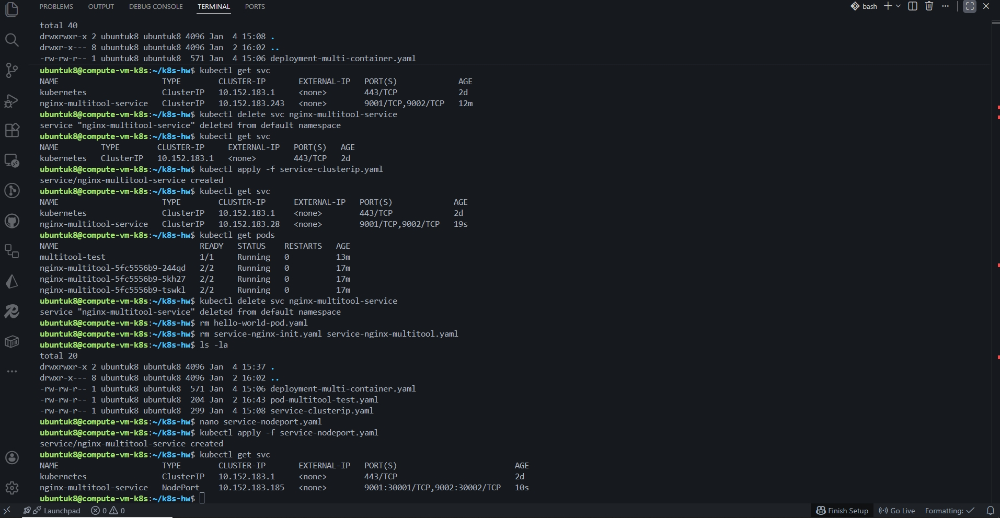
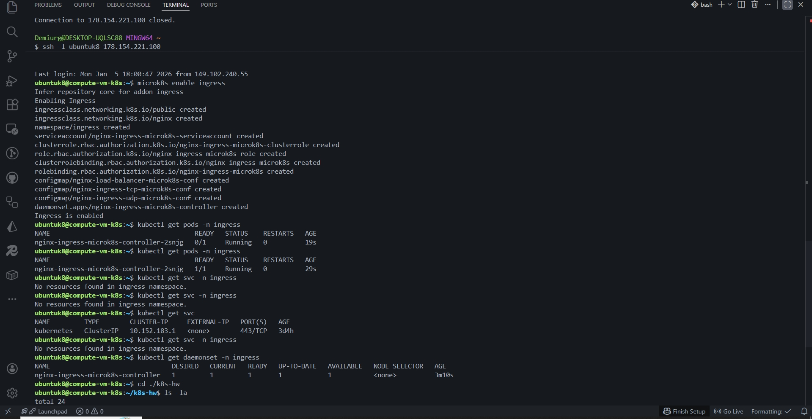
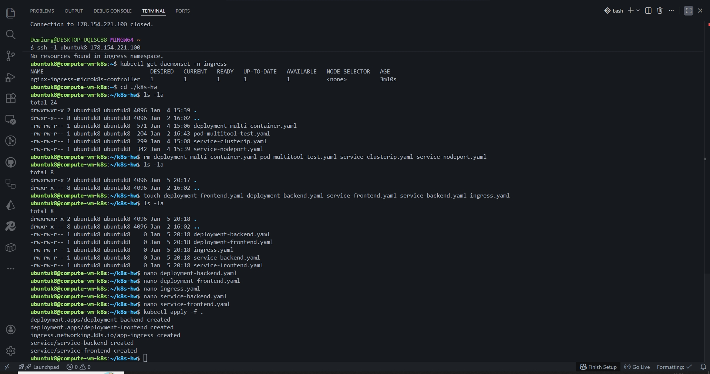
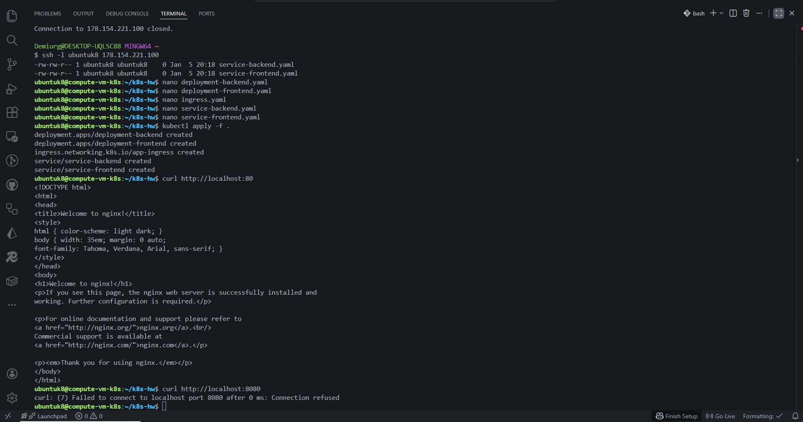

## Задание 1:

---

## Задание 2:

---

- [Ссылка на deployment-backend.yaml manifest](./k8s/deployment-backend.yaml)
- [Ссылка на deployment-frontend.yaml manifest](./k8s/deployment-frontend.yaml)
- [Ссылка на deployment-multi-container.yaml manifest](./k8s/deployment-multi-container.yaml)
- [Ссылка на ingress.yaml manifest](./k8s/ingress.yaml)
- [Ссылка на pod-multitool-test.yaml manifest](./k8s/pod-multitool-test.yaml)
- [Ссылка на service-backend.yaml manifest](./k8s/service-backend.yaml)
- [Ссылка на service-clusterip.yaml manifest](./k8s/service-clusterip.yaml)
- [Ссылка на service-frontend.yaml manifest](./k8s/service-frontend.yaml)
- [Ссылка на service-nodeport.yaml manifest](./k8s/service-nodeport.yaml)
