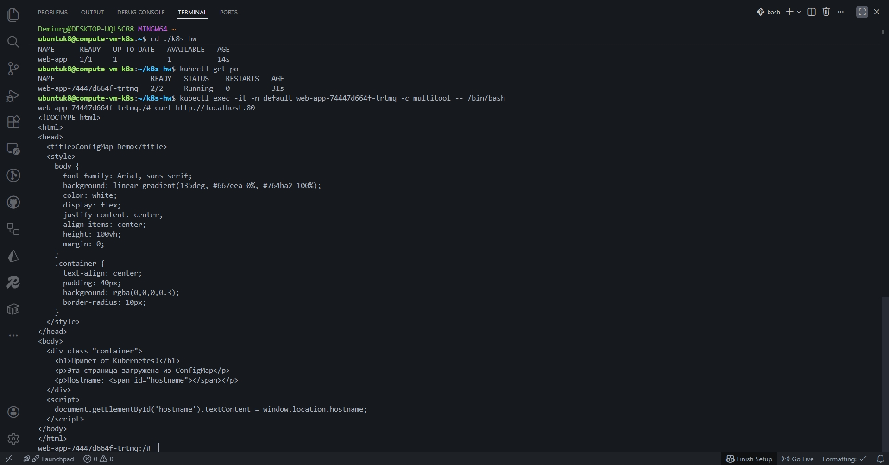
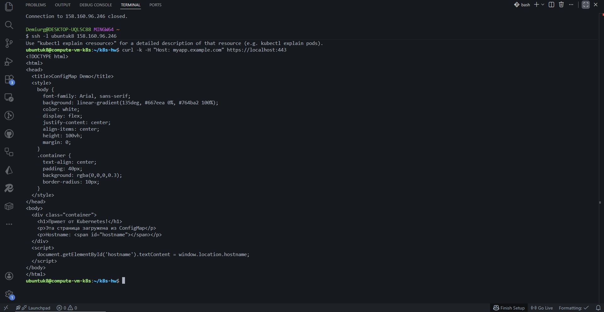
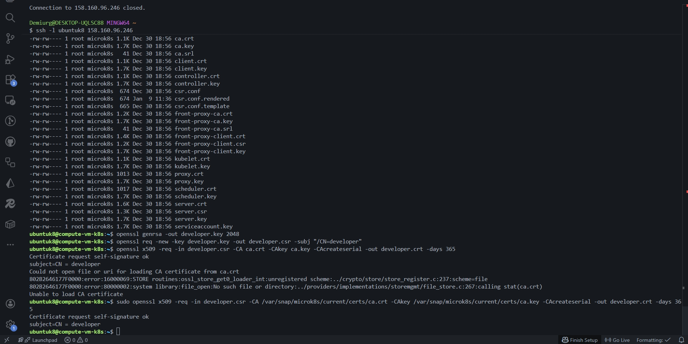
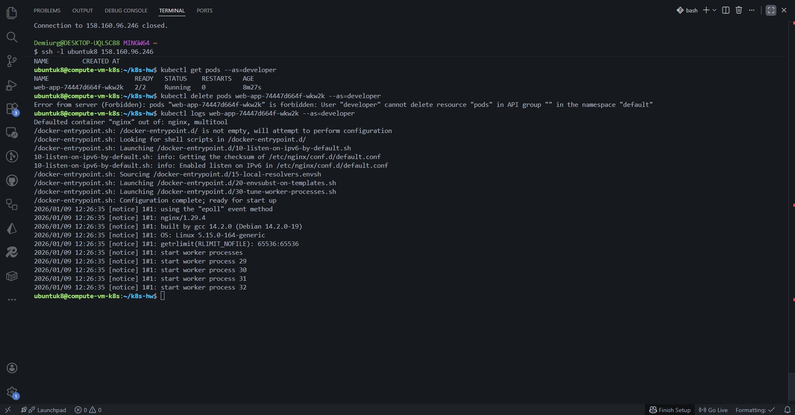

## Задание 1:

---

## Задание 2:

---

## Задание 3:

---

- [Ссылка на configmap-web.yaml manifest](./k8s/configmap-web.yaml)
- [Ссылка на deployment.yaml manifest](./k8s/deployment.yaml)
- [Ссылка на ingress-tls.yaml manifest](./k8s/ingress-tls.yaml)
- [Ссылка на role-pod-reader.yaml manifest](./k8s/role-pod-reader.yaml)
- [Ссылка на rolebinding-developer.yaml manifest](./k8s/rolebinding-developer.yaml)
- [Ссылка на secret-tls.yaml manifest](./k8s/secret-tls.yaml)
- [Ссылка на service.yaml manifest](./k8s/service.yaml)
