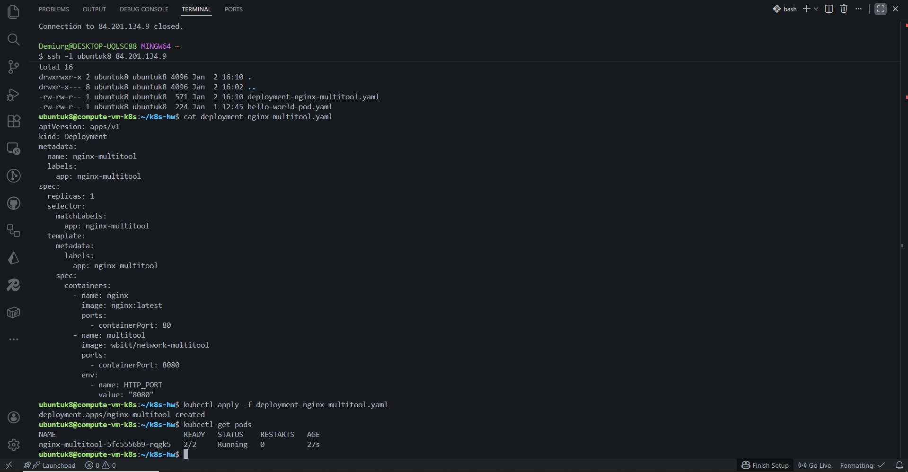
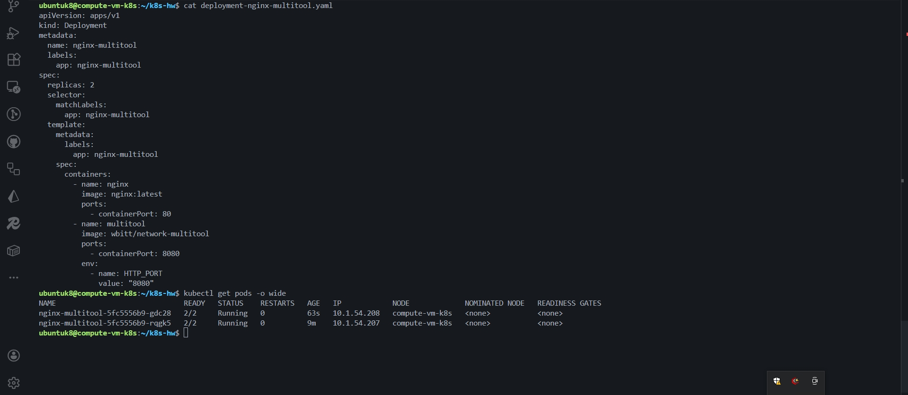
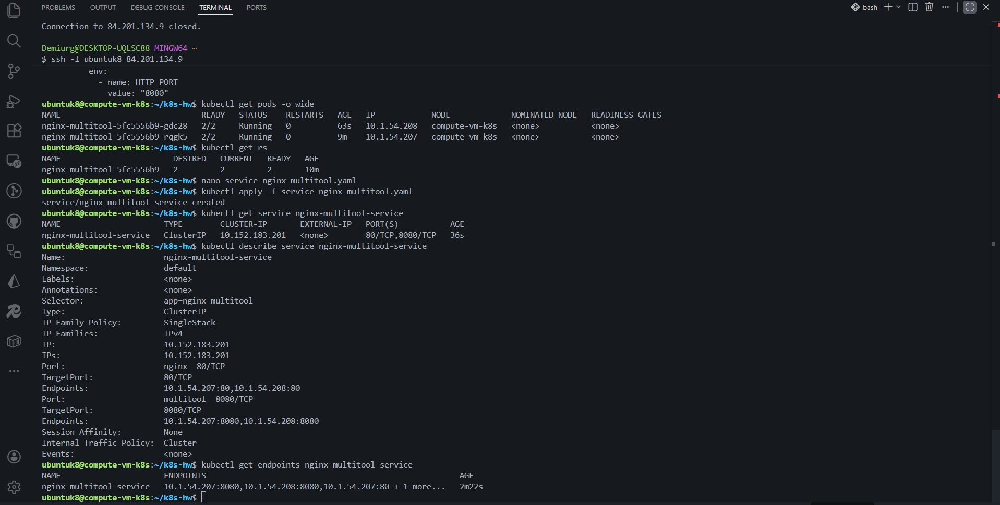
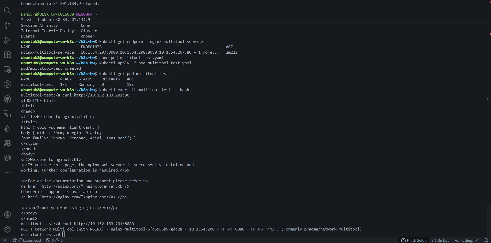
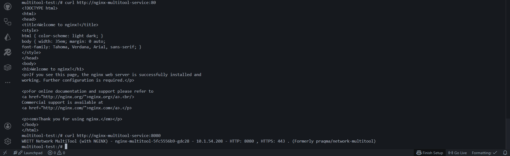
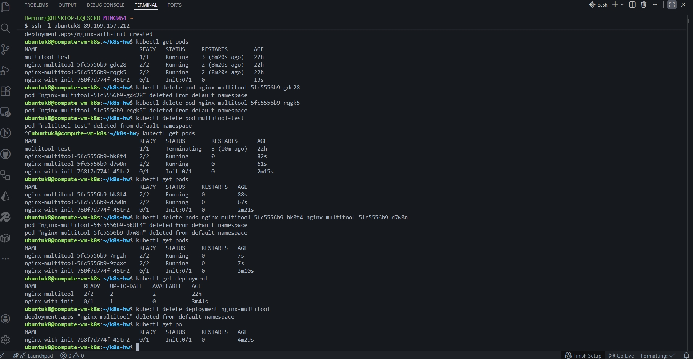
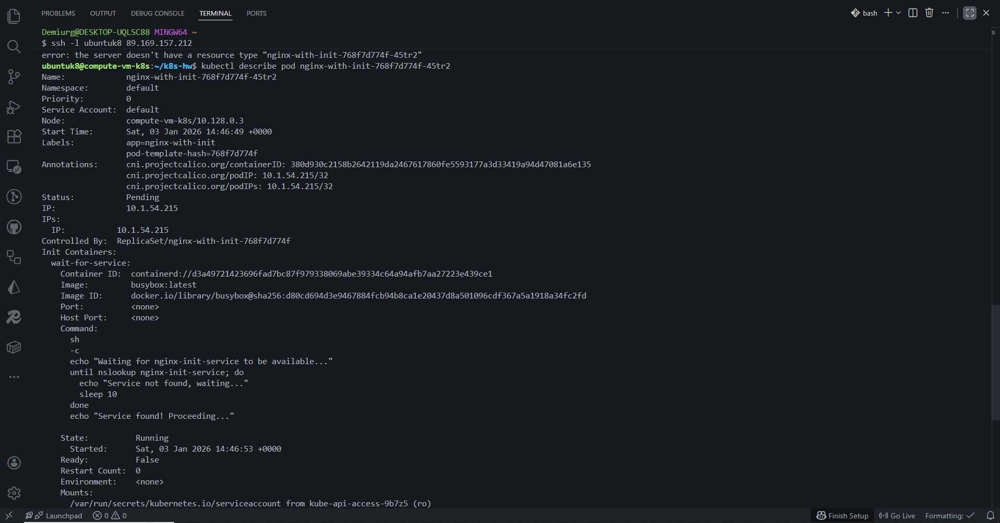
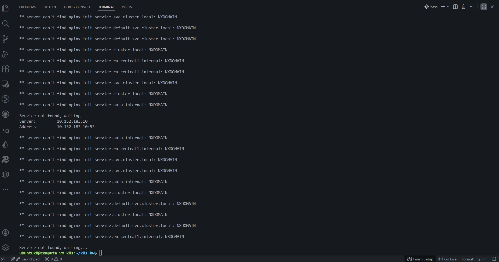
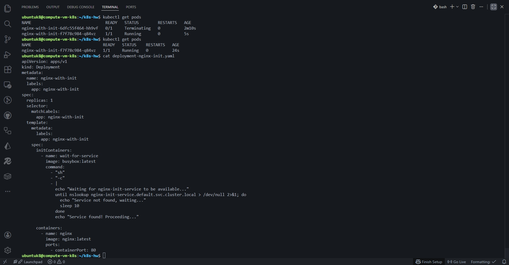

## Задание 1:

## 

## 

## 

## 

---

## Задание 2:

## 

## 

## 

---

- [Ссылка на deployment-nginx-init.yaml manifest](./k8s/deployment-nginx-init.yaml)
- [Ссылка на deployment-nginx-multitool.yaml manifest](./k8s/deployment-nginx-multitool.yaml)
- [Ссылка на pod-multitool-test.yaml manifest](./k8s/pod-multitool-test.yaml)
- [Ссылка на service-nginx-init.yaml manifest](./k8s/service-nginx-init.yaml)
- [Ссылка на service-nginx-multitool.yaml manifest](./k8s/service-nginx-multitool.yaml)
