## Задание 1:

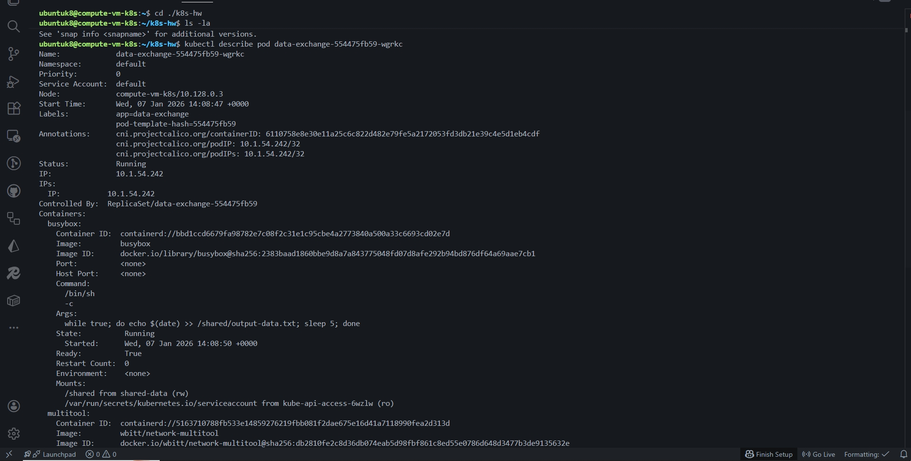

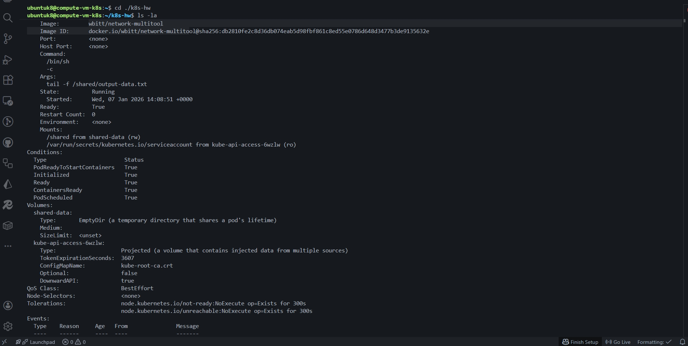

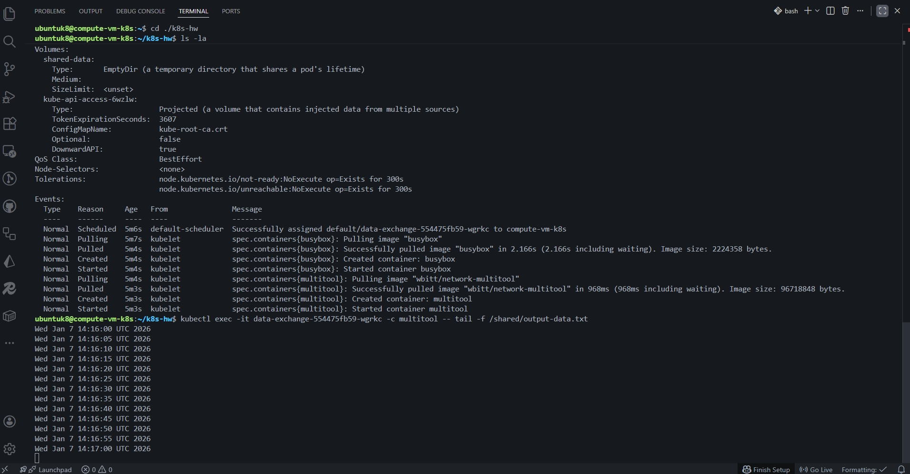

---

## Задание 2:

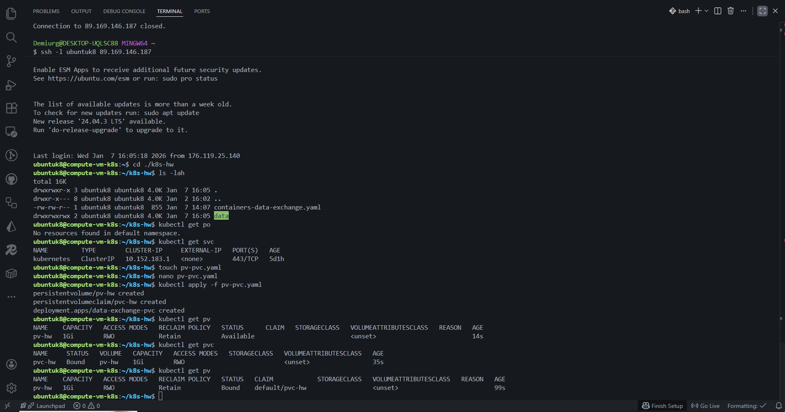

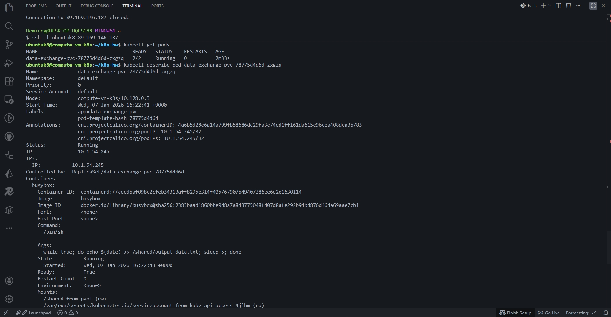

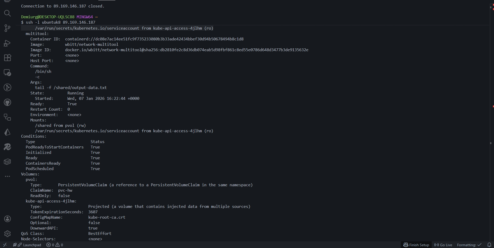

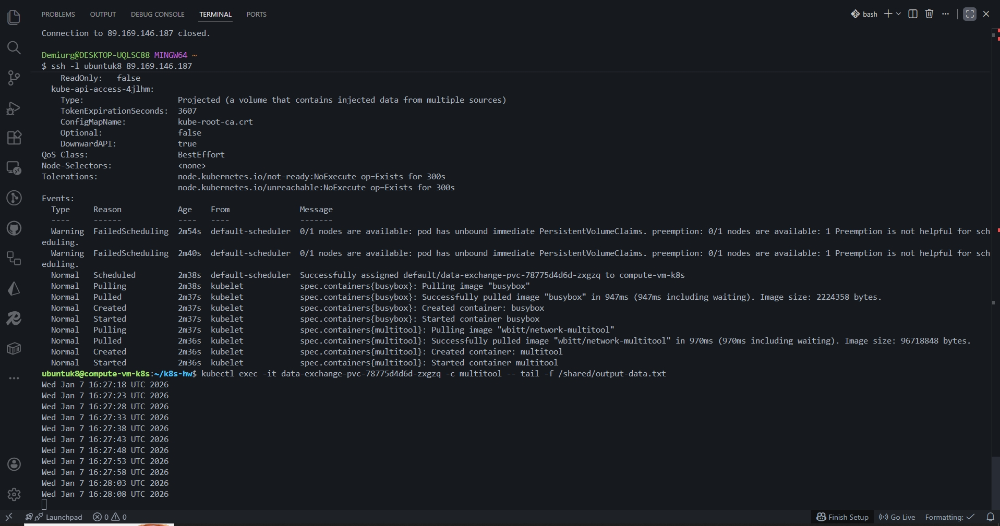

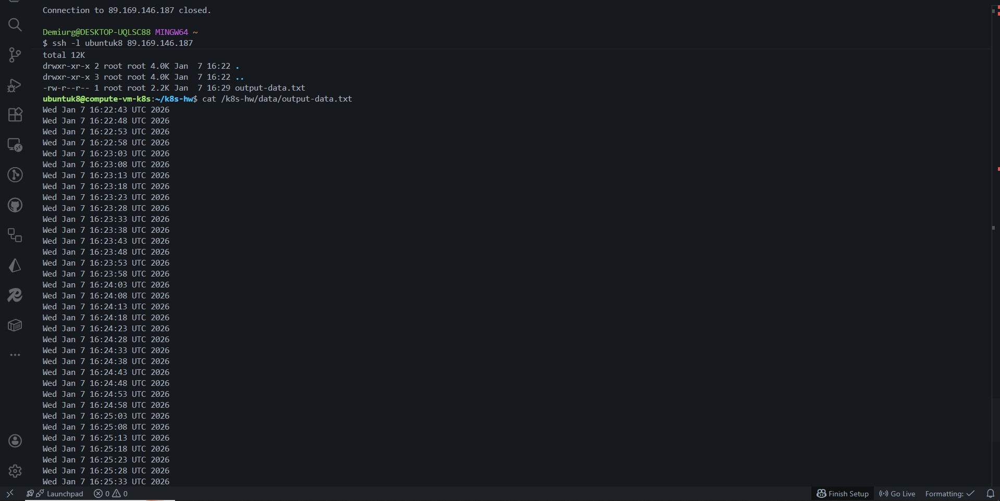

- При Reclaim Policy Retain не происходит удаление pv при удалении pvc

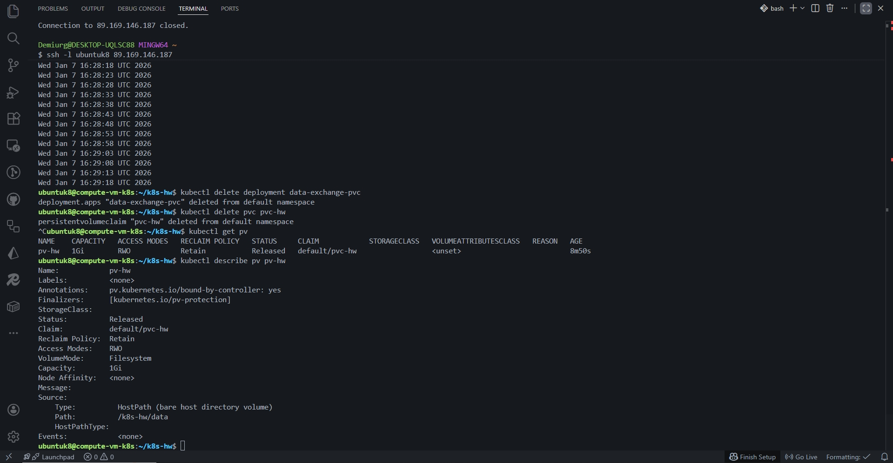

- Так же при Reclaim Policy Retain не происходит удаление файла при удалении pvc

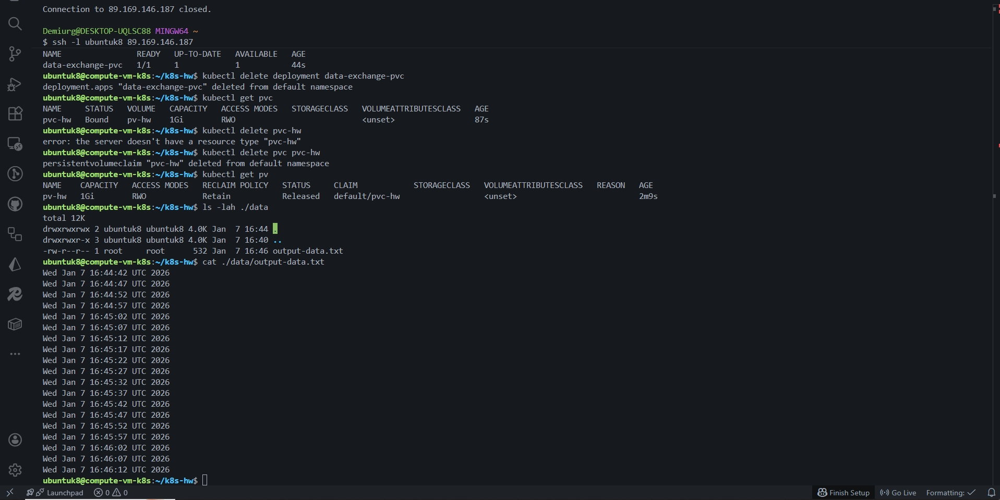

- Так же при удалении pv не происходит удаление файла потому что удаляется абстракция, а не сам файл.

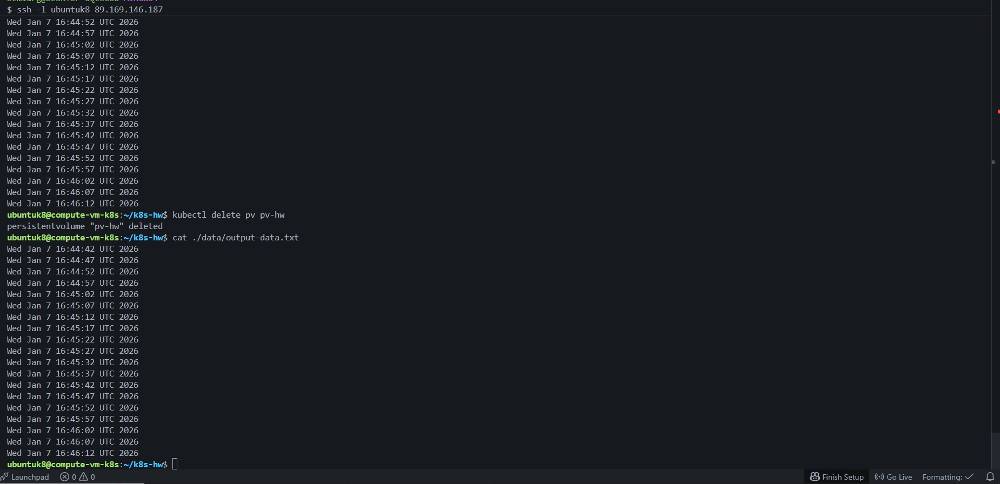

---

## Задание 3:

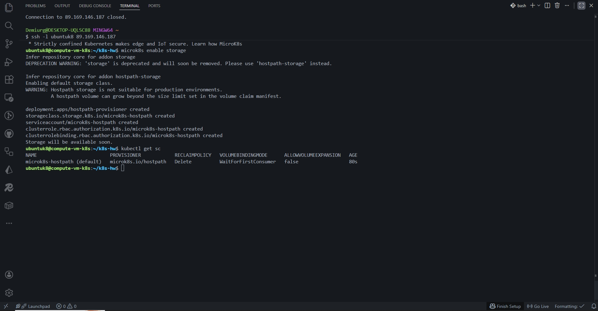

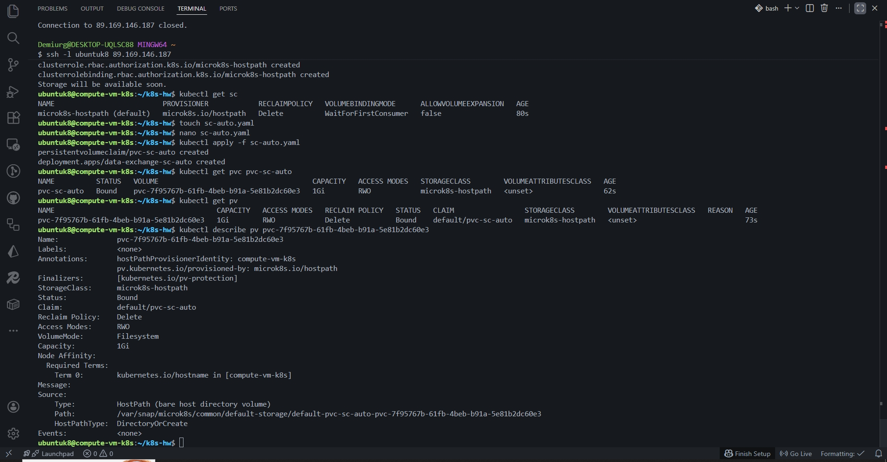

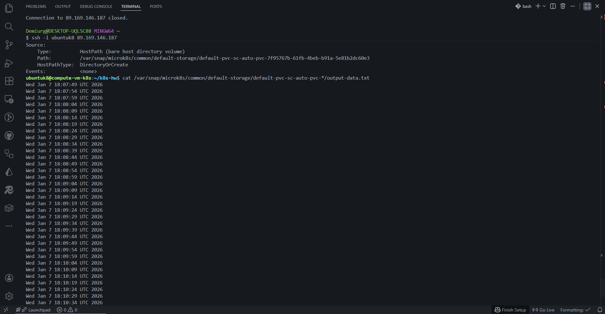

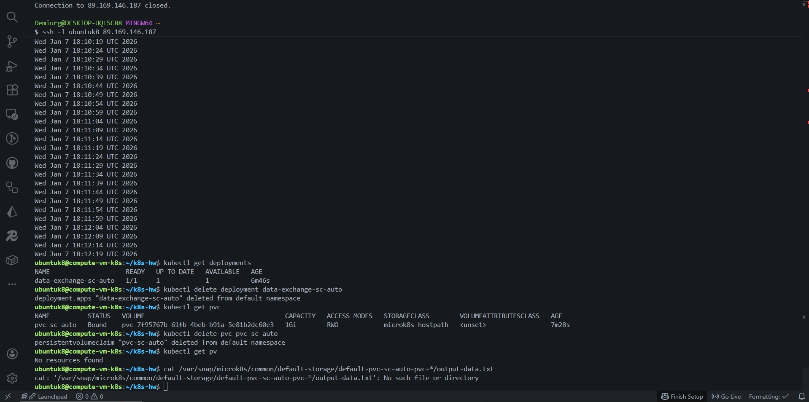

---

- [Ссылка на containers-data-exchange.yaml manifest](./k8s/containers-data-exchange.yaml)
- [Ссылка на pv-pvc.yaml manifest](./k8s/pv-pvc.yaml)
- [Ссылка на sc-auto.yaml manifest](./k8s/sc-auto.yaml)
